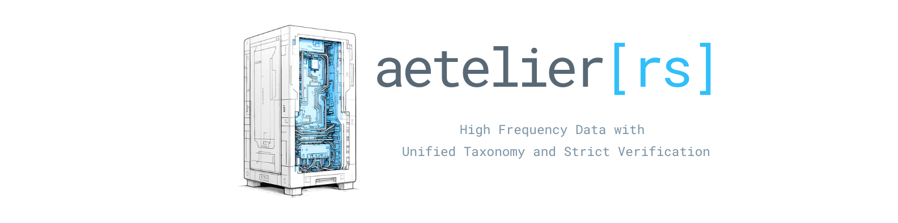

<br>

[![Build][badge-build]][url-build]
[![Rust][badge-rust]][url-rust]
[![Apache-2.0 licensed][badge-license]][url-license]

[badge-build]: https://github.com/IteraLabs/aetelier-sdk/actions/workflows/ci.yml/badge.svg
[url-build]: https://github.com/IteraLabs/aetelier-sdk/actions/workflows/ci.yml
[badge-rust]: https://img.shields.io/badge/rust-1.88%2B-orange.svg?maxAge=3600
[url-rust]: https://github.com/IteraLabs/aetelier-sdk
[badge-license]: https://img.shields.io/badge/license-Apache--2.0-00baf5.svg
[url-license]: LICENSE

<br>

# aetelier-sdk

A Rust engine for high-frequency market-microstructure data: live connectivity to 12 crypto exchanges, verified order-book reconstruction, trade loss accounting, grid synchronization, and columnar Parquet I/O — built for quant researchers who need to trust every row.

Every venue decoder is certified by a conformance suite that replays real captured wire frames through the production decode path on every CI run: seeding, delta application, sequence-gap detection, checksum validation, trade continuity, and physical book invariants (never crossed, strictly positive, ordered). Exact decimal arithmetic in memory; analytics-friendly Float64 Parquet on disk.

## 60-second quickstart

Live top-of-book from Binance, no API keys, no configuration:

```
cargo run -p aetelier-connect --example framework_live binance 8 BTCUSDT
```

```
live: binance BTCUSDT for 8s — model SeqDelta { predicate: RangeInclusive, source: RestSnapshot }
BTC/USDT #2     bid 66327.05000000 x1.43759000 | ask 66327.06000000 x2.34211000 | spread 0.01000000 | ts 1784669353249446 | depth 5000/5000
BTC/USDT #14    bid 66327.05000000 x0.90601000 | ask 66327.06000000 x2.34273000 | spread 0.01000000 | ts 1784669354314000 | depth 5010/4997
```

As a library, the curated facade exposes the whole engine through one crate:

```rust
use aetelier_sdk::{Trade, TradeSide, TradingPair};

let trade = Trade::builder()
    .source_trade_ts_us(1_700_000_000_000_000)
    .pair(TradingPair::new("BTC", "USDT"))
    .side(TradeSide::Buy)
    .amount(0.5)
    .price(42_000.0)
    .exchange("binance".into())
    .id("t-1".into())
    .build()
    .expect("all fields set");

assert_eq!(trade.pair.to_canonical(), "BTC/USDT");
```

More examples — config-driven collection to Parquet, read-back statistics, multi-venue sync, raw wire capture — in [aetelier-connect/examples](aetelier-connect/examples/README.md).

## Install

Until the crates.io release, depend on the workspace via git, pinned to the release tag:

```toml
[dependencies]
aetelier-sdk = { git = "https://github.com/IteraLabs/aetelier-sdk", tag = "v0.1.0", features = ["parquet"] }
```

crates.io publication is on the roadmap; the crate layout and publish order are already prepared.

## Workspace

| Crate | Role |
|---|---|
| `aetelier-types` | Canonical no-IO schema crate: trades, order books, liquidations, funding, configs. `forbid(unsafe_code)`. |
| `aetelier-connect` | Exchange connectivity: WSS transports, per-venue adapters, reconstruction runtime, synchronizers, workers. |
| `aetelier-io` | Columnar persistence: Parquet/JSON/CSV writers and readers, dataset tooling, batch rehydration. |
| `aetelier-telemetry` | Metrics and log surfaces for collectors. |
| `aetelier-sdk` | The curated facade: one dependency, named re-exports of the recommended path. |

## Venues

All 12 spot venues run the same certified framework path: binance, bitget, bitso, bybit, coinbase, gateio, htx, kraken, kucoin, okx, poloniex, upbit. Certification means the venue's real captured frames replay through the production decoder in CI across the full conformance matrix — decode surface, seeding taxonomy, symbol canonicalization, book delta application, gap detection, checksum validation where the venue supplies one, trade continuity where the venue's ids permit exact accounting, and physical book/trade invariants.

## Data honesty

The engine never fabricates: unknown trade sides are dropped and counted, never coerced; malformed rows are typed errors, never silent defaults; trade loss is counted exactly where venue sequences allow and labeled as an estimate where they do not; every recovered print carries its provenance (`origin: ws | rest`). Loss, gap, and recovery counters ride every collector as first-class metrics.

## Open core

This repository is the open data layer of the Aetelier platform: everything needed to collect, verify, and persist market data on infrastructure you control. The managed orchestration, hosted dashboards, and billing services are a separate hosted product at [aetelier.xyz](https://aetelier.xyz).

## Contributing

See [CONTRIBUTING.md](CONTRIBUTING.md) for the development loop, testing tiers, and the crate publish order. Security reports: [SECURITY.md](SECURITY.md).

## License

Apache-2.0 — see [LICENSE](LICENSE).
